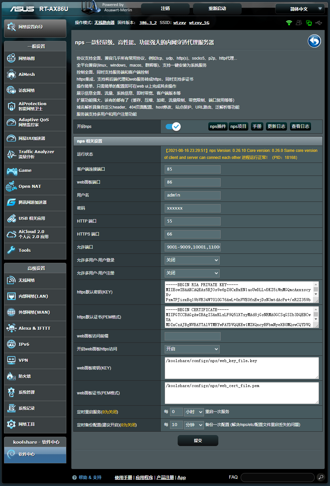

# KoolShare nps

nps server for Koolshare

## 说明

本插件参考了[frps插件](https://github.com/koolshare/rogsoft)的代码，根据[nps插件](https://github.com/ehang-io/nps)编译好的的包，进行封装成路由器插件。

本机基于AX86U进行测试，适用于koolshare 梅林改/官改 hnd/axhnd/axhnd.675x固件平台，其他机型未测试。

这是本人第一次尝试编写路由器插件，本打算开发自用的，现在分享出来，如果能帮到大家，那就更好了。

## 更新日志：

Koolshare Nps Changelog
-------------------------------------------
- 2020-08-13: v1.0.1 (nps版本:v0.26.10)
  - 第一个beta版本
- 2020-08-13: v1.0.2
  - 添加端口防火墙设置
- 2020-08-13: v1.0.3
  - 添加自定义端口范围以及自定端口的自动添加防火墙放行、允许多用户登录、允许用户注册的配置
- 2020-08-14: v1.0.4
  - 添加配置文件自动备份任务(同步时间可自定义)，解决路由器重启后，配置丢失的问题
- 2020-08-14: v1.0.5
  - 添加配置文件自动备份任务(同步时间可自定义)，解决路由器重启后，配置丢失的问题(优化)
- 2020-08-16: v1.1.1
  - 完美解决/etc/nps/在重启路由器丢失的问题
    - 1.软件停止时，检测配置文件是否变化，如果有变化实时备份配置文件。在软件启动时，还原配置文件到/etc/nps/。
    - 2.建议开启[定时备份配置]功能，开启后，会定时检查配置文件是否变化，如果有变化实时备份配置文件。
- 2020-08-16: v1.1.2
  - 优化重启路由后，页面为空的问题

## 运行图：

